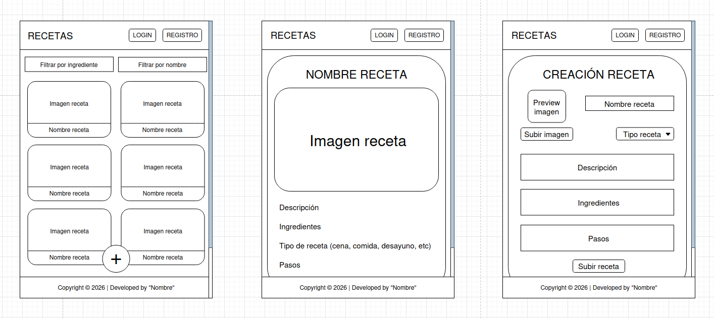

# 🍳 RECETAS

## 📌 Descripción

**RECETAS** es una aplicación web que almacena recetas predefinidas y permite crear nuevas recetas personalizadas.

Los usuarios pueden ver distintas recetas desde la página principal o añadir las suyas propias mediante un formulario de creación.  
Una vez creada, la receta se muestra en el listado principal junto a las demás.

La aplicación está creada en Angular y usa como tecnologías:

- TypeScript
- JavaScript
- CSS Plano
- Bootstrap

---

## ⚙️ Funcionalidades

### 🖼 Visualización de recetas
- Listado de recetas en **cards**.  
- Cada receta muestra su **imagen** y **nombre**.  
- Al clicarlas se ofrece una **vista detallada** con toda la información.

### 🔍 Sistema de filtrado
- Filtrado de recetas por **nombre**.  
- Filtrado de recetas por **ingrediente**.

### 📝 Creación de recetas
- El usuario puede crear nuevas recetas rellenando un **formulario con los datos requeridos**.

---

## 🖥 Pantallas de la aplicación

### 🏠 Página Principal
Muestra todas las recetas disponibles y permite aplicar filtros por nombre o ingrediente.  
Incluye un botón para acceder a la creación de una nueva receta.

### 📄 Vista de Receta
Muestra toda la información detallada de una receta seleccionada: 
- Nombre 
- Imagen  
- Descripción  
- Ingredientes  
- Tipo de receta  
- Pasos

### 🆕​ Creación de receta
El usuario puede crear una nueva receta rellenando un formulario con los siguientes datos:  

- Nombre del plato
- Imagen
- Tipo de receta (desayuno, comida, cena, etc.)
- Descripción de la receta
- Ingredientes usados
- Pasos de preparación

Al enviar el formulario, se añade la receta al listado principal.

---

## ✏️ Mockup del proyecto

---

© 2026 – Desarrollado por **Iván Mozo Lozano**
