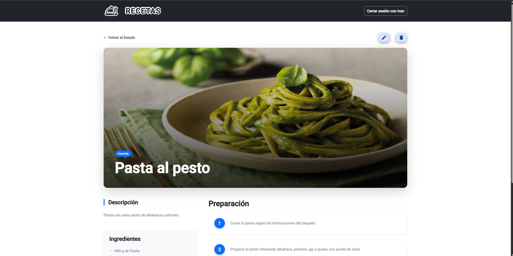
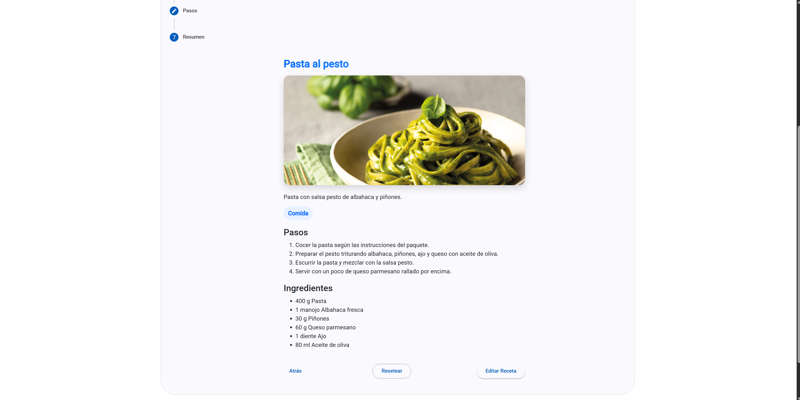
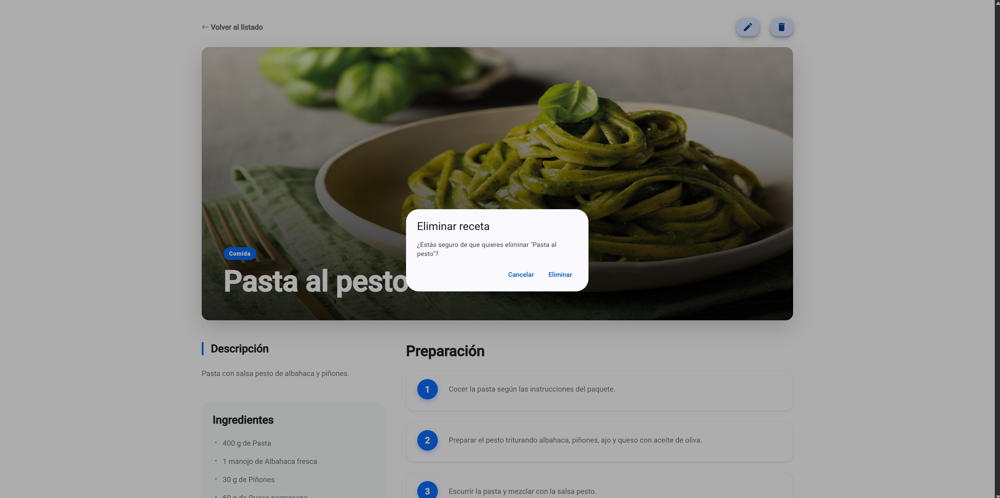
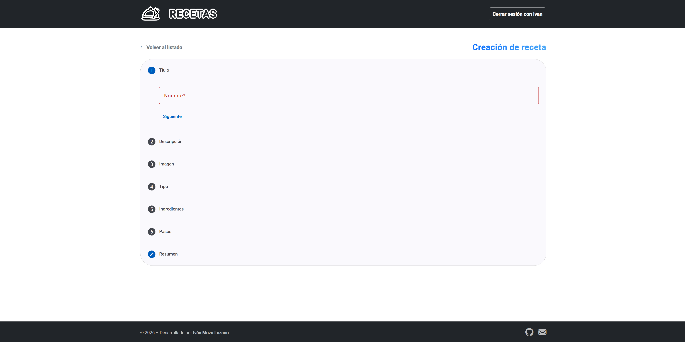

# 🍳 RECETAS

## 📌 Descripción

**RECETAS** es una aplicación web dónde los usuarios pueden ver y filtrar distintas recetas desde el Listado de recetas, pueden crearlas, editarlas o eliminarlas. 
Una vez creada, la receta se muestra en el listado junto a las demás. Todos los datos de las recetas se almacenan y se consumen desde una API.

La aplicación está creada en Angular y usa como tecnologías:

- TypeScript
- JavaScript
- CSS Plano
- Bootstrap
- Json Server

---

## ⚙️ Funcionalidades

### 🗣️ Inicio de sesión y registro
- Los usuarios que usen la web podrán crearse una cuenta y usarla mediantando los formularios de **Login** y **Registro**.

### 🚢 Navegación en Landing Page
- Navegación al **listado**, o a la **creación** de recetas integrada en la página inicial del proyecto.

### 🚢 Navegación en NavBar
- Navegación al **Login**, al **Registro** o a la **Landing Page** integrada en el NavBar.
- Incluye un botón de **cerrar sesión** que aparece mientras se use una cuenta, también se indica el **nombre** de dicho usuario en uso.

### 🚢 Navegación en Footer
- Navegación a mi **github** y a mi **correo electrónico** integrada en el Footer.

### 🖼 Visualización de recetas
- Listado de recetas en **cards**.  
- Cada receta muestra su **imagen**, su **nombre** y su **tipo**.  
- Al clicarlas se ofrece una **vista detallada** con toda la información.

### 🔍 Sistema de filtrado
- Filtrado de recetas por **nombre**.  
- Filtrado de recetas por **ingrediente**.
- Filtrado de recetas por **tipo**.

### 📝 Creación de recetas
- El usuario puede crear nuevas recetas rellenando un **formulario con los datos requeridos**, todos los campos tienen sus validaciones.
- Acceso a dicho formulario clicando el boton de **Crear receta** que hay en el listado.

### ✍️ Edición de recetas
- El usuario puede editar recetas rellenando un **formulario que carga los datos existentes**, todos los campos tienen sus validaciones.
- Acceso al formulario clicando el icono de un **lápiz** que hay en el la vista de la receta detallada.

### 🗑️ Eliminar recetas
- El usuario puede eliminar recetas pulsando el icono de una **papelera** que hay en la vista detallada de la receta en cuestión.

---

## 🖥 Pantallas de la aplicación

### 🏠 Página Principal
Landing page que introduce la aplicación y permite navegar al Listado y a la creación de recetas.

### 🆕 Registro
Formulario para crear una cuenta nueva y poder con la misma interactuar con las recetas.

### 🚪 Login
Formulario para iniciar sesión con una cuenta existente, sin iniciar sesión no se permite ver, crear, editar o eliminar ninguna receta.

### 📋 Listado de recetas
Muestra todas las recetas disponibles y permite aplicar filtros por nombre, ingrediente o tipo.  
Incluye un botón para acceder a la creación de una nueva receta.

### 📄 Vista de Receta
Muestra toda la información detallada de una receta previamente clicada en el listado, y además permite editarla o eliminarla: 
- Nombre 
- Imagen  
- Descripción  
- Ingredientes  
- Tipo de receta  
- Pasos

### ✏️ Edición de receta
El usuario puede editar una receta existente bajo confirmación previa, rellenando un formulario con los siguientes datos ya cargados:  

- Nombre del plato
- Imagen
- Tipo de receta (desayuno, comida, cena, etc.)
- Descripción de la receta
- Ingredientes usados
- Pasos de preparación

Al enviar el formulario, se actualiza la receta y redirige al listado principal.

### 🚮 Borrado de receta
El usuario puede borrar una receta existente bajo confirmación previa, tras ello se redirige al listado principal.

### 🆕​ Creación de receta
El usuario puede crear una nueva receta rellenando un formulario con los siguientes datos:  

- Nombre del plato
- Imagen
- Tipo de receta (desayuno, comida, cena, etc.)
- Descripción de la receta
- Ingredientes usados
- Pasos de preparación

Al enviar el formulario, se añade la receta al listado principal.

---

© 2026 – Desarrollado por **Iván Mozo Lozano**
